# FREQUENCY ANALYSIS IN HYDROLOGY (fiako-anfrek)

<div align="center">
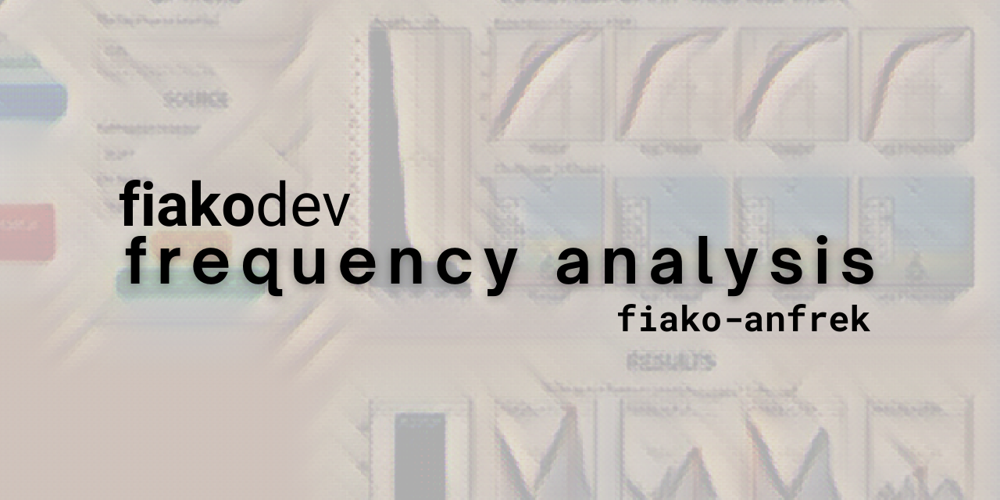<br>


<br>


</div>

**Frequency Analysis in Hydrology** atau `fiako-anfrek` adalah aplikasi web yang dapat digunakan untuk menghitung parameter statistik, jenis sebarannya (distribusi), analisis frekuensi, dan uji kecocokan distribusi. Output aplikasi ini berupa visualisasi hasil perhitungan dan tabel/teks berupa .csv/.txt. 

## FITUR APLIKASI

<div align="center">
<h3>Eksplorasi Data Deret Waktu</h3>
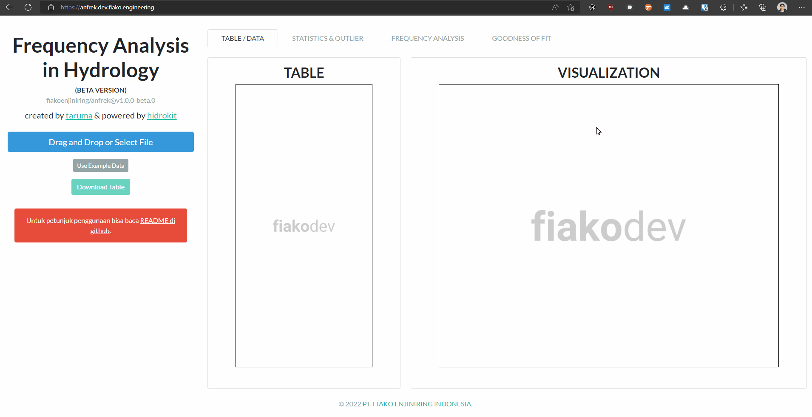
<br>
<span align="center">Interaksi Tabel + Grafik</span>
</div>

<div align="center">
<h3>Parameter Statistik dan Outlier</h3>
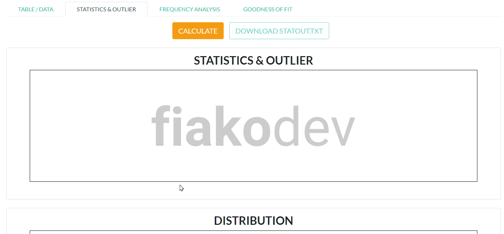
<br>
<span align="center">Visualisasi Statistik & Outlier</span>
<br><br>
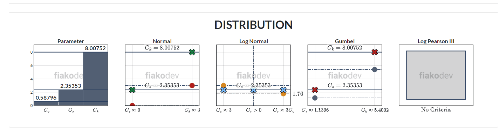
<br>
<span align="center">Visualisasi Distribusi</span>
<br><br>
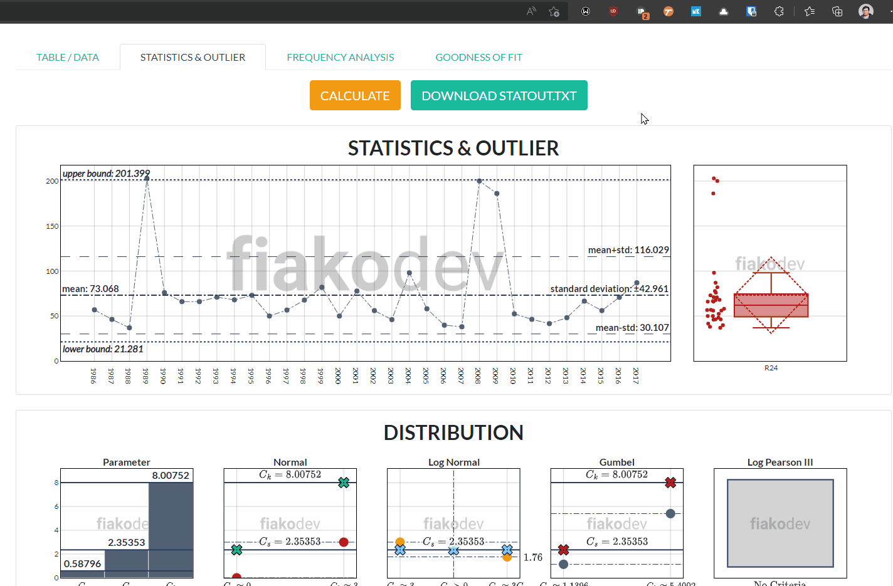
<br>
<span align="center">Download Hasil Perhitungan</span>
</div>

<div align="center">
<h3>Analisis Frekuensi</h3>
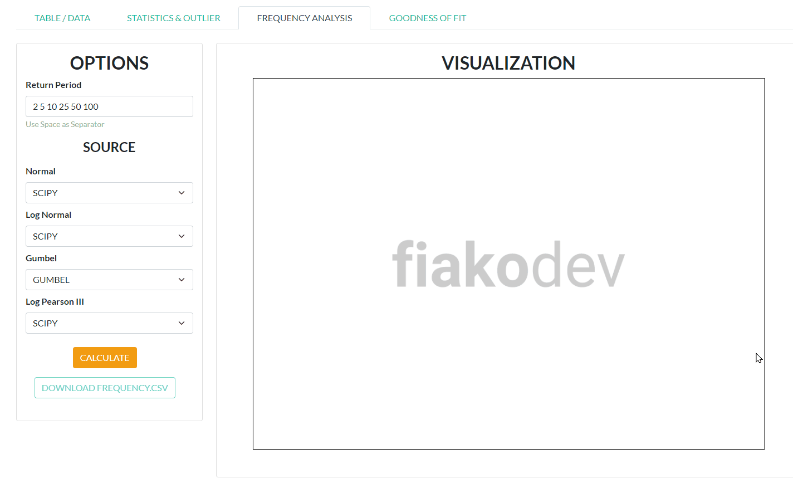
<br>
<span align="center">Interaksi Input + Grafik</span>
<br><br>
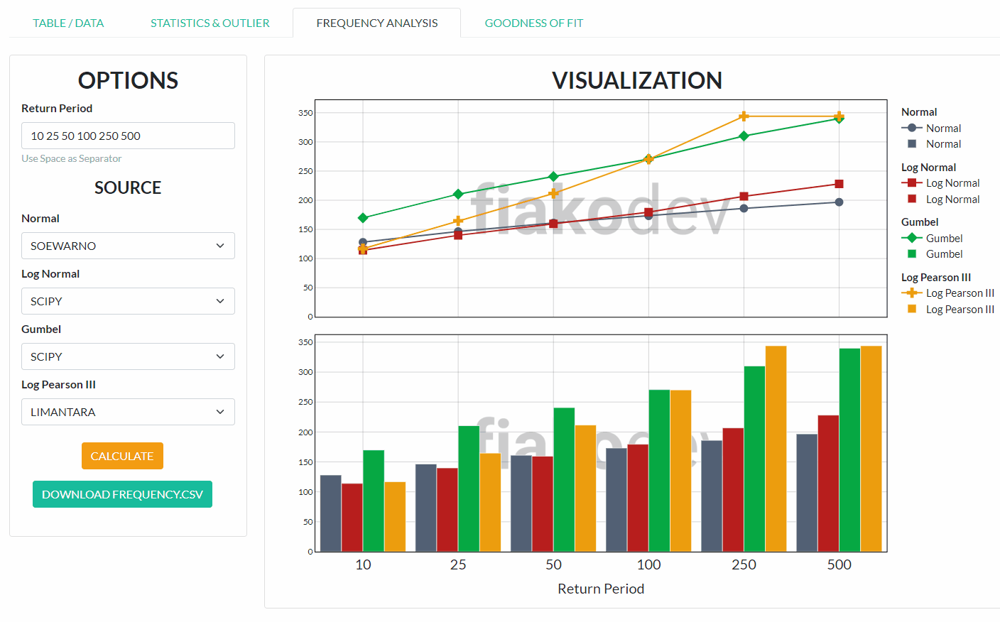
<br>
<span align="center">Interaksi Grafik</span>
<br><br>
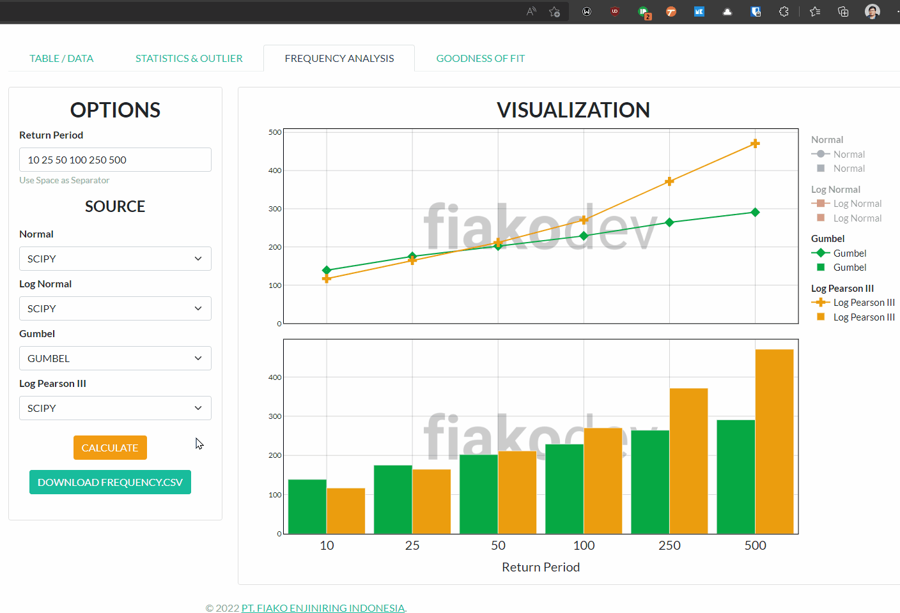
<br>
<span align="center">Download Hasil Analisis</span>
</div>

<div align="center">
<h3>Uji Kecocokan Distribusi</h3>
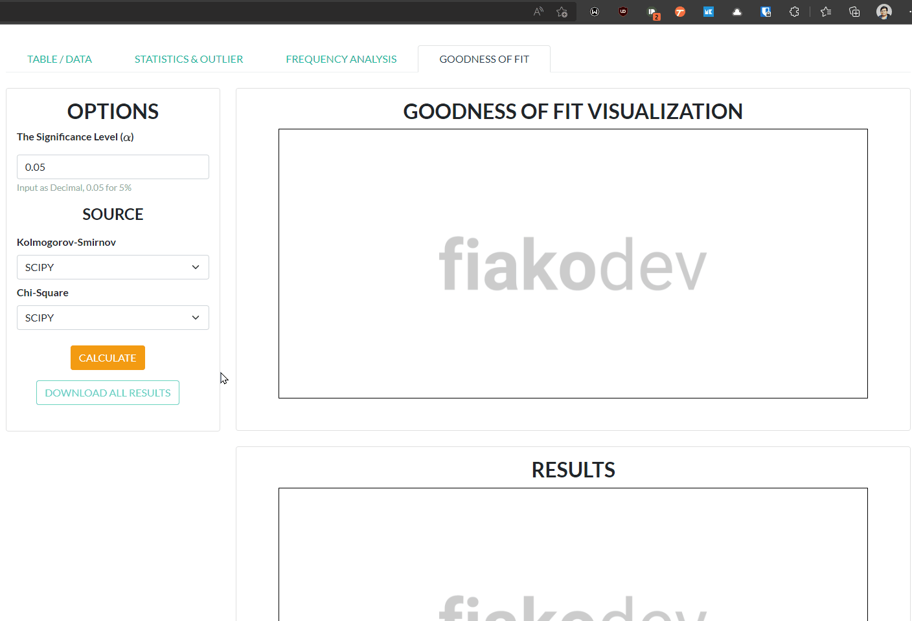
<br>
<span align="center">Interaksi Input + Grafik</span>
<br><br>
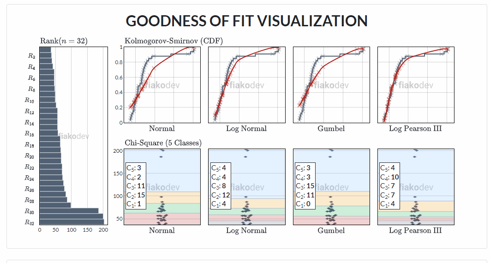
<br>
<span align="center">Visualisasi Uji Kecocokan Distribusi</span>
<br><br>
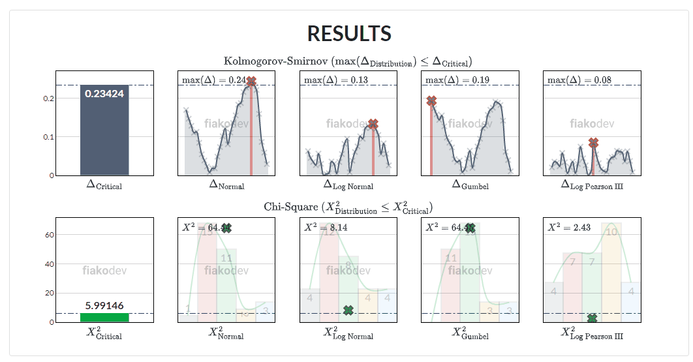
<br>
<span align="center">Visualisasi Hasil Pengujian</span>
<br><br>

<br>
<span align="center">Download Hasil Pengujian</span>
</div>

## KEKURANGAN

Berikut daftar kekurangan atau _known issues_ aplikasi ini:

- Penggunaan distribusi Log Pearson III (terutama untuk memperoleh nilai CDF) harus dievaluasi kembali (untuk sumber scipy).
- Penentuan kelas dan parameter untuk uji Chi-Square harus dievaluasi kembali. 


## LICENSE

[MIT LICENSE](./LICENSE)

```
Copyright (c) 2022 PT. FIAKO ENJINIRING INDONESIA

Permission is hereby granted, free of charge, to any person obtaining a copy
of this software and associated documentation files (the "Software"), to deal
in the Software without restriction, including without limitation the rights
to use, copy, modify, merge, publish, distribute, sublicense, and/or sell
copies of the Software, and to permit persons to whom the Software is
furnished to do so, subject to the following conditions:

The above copyright notice and this permission notice shall be included in all
copies or substantial portions of the Software.

THE SOFTWARE IS PROVIDED "AS IS", WITHOUT WARRANTY OF ANY KIND, EXPRESS OR
IMPLIED, INCLUDING BUT NOT LIMITED TO THE WARRANTIES OF MERCHANTABILITY,
FITNESS FOR A PARTICULAR PURPOSE AND NONINFRINGEMENT. IN NO EVENT SHALL THE
AUTHORS OR COPYRIGHT HOLDERS BE LIABLE FOR ANY CLAIM, DAMAGES OR OTHER
LIABILITY, WHETHER IN AN ACTION OF CONTRACT, TORT OR OTHERWISE, ARISING FROM,
OUT OF OR IN CONNECTION WITH THE SOFTWARE OR THE USE OR OTHER DEALINGS IN THE
SOFTWARE.
```
